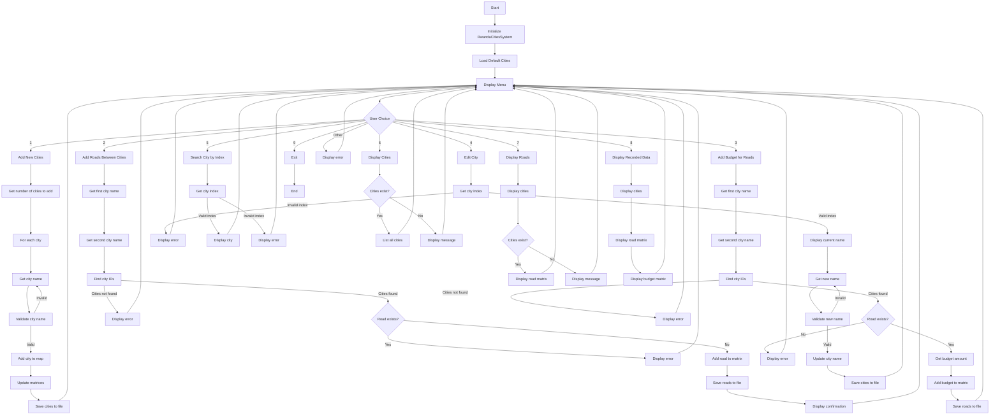
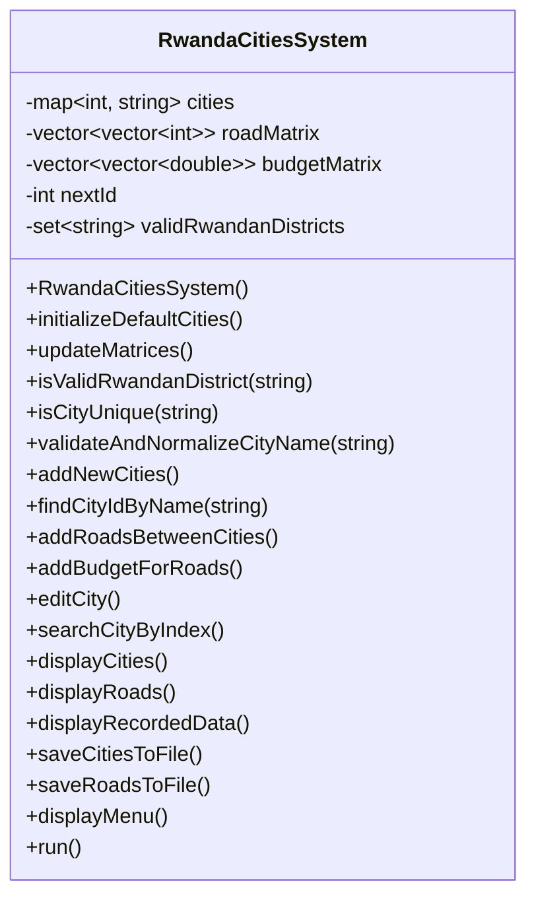
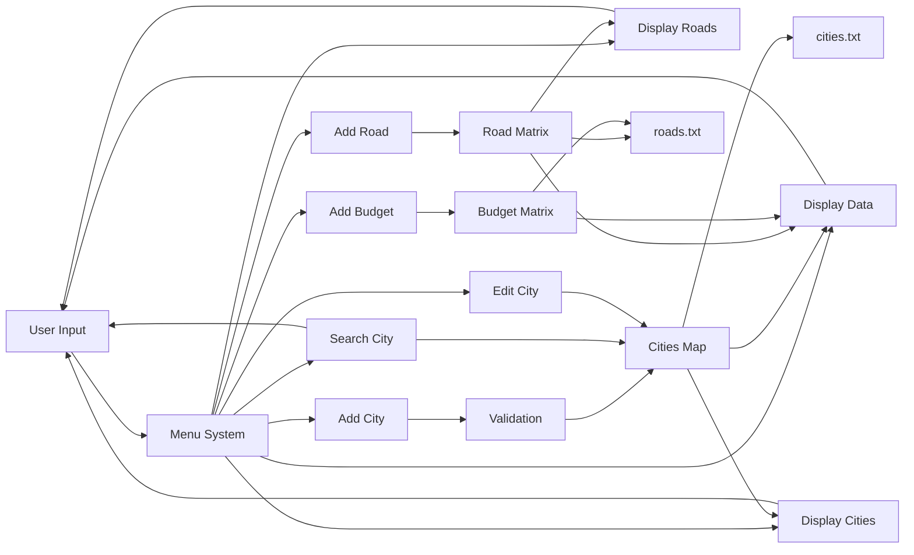

# Flowchart for Rwanda Cities System



## Class Structure



## Data Flow Diagram



## Key Functions and Their Relationships

```mermaid
flowchart TD
    Main[main()] --> Run[run()]
    Run --> DisplayMenu[displayMenu()]
    
    Run --> AddNewCities[addNewCities()]
    Run --> AddRoadsBetweenCities[addRoadsBetweenCities()]
    Run --> AddBudgetForRoads[addBudgetForRoads()]
    Run --> EditCity[editCity()]
    Run --> SearchCityByIndex[searchCityByIndex()]
    Run --> DisplayCities[displayCities()]
    Run --> DisplayRoads[displayRoads()]
    Run --> DisplayRecordedData[displayRecordedData()]
    
    AddNewCities --> ValidateAndNormalizeCityName[validateAndNormalizeCityName()]
    ValidateAndNormalizeCityName --> IsValidRwandanDistrict[isValidRwandanDistrict()]
    ValidateAndNormalizeCityName --> IsCityUnique[isCityUnique()]
    AddNewCities --> UpdateMatrices[updateMatrices()]
    AddNewCities --> SaveCitiesToFile[saveCitiesToFile()]
    
    AddRoadsBetweenCities --> FindCityIdByName[findCityIdByName()]
    AddRoadsBetweenCities --> SaveRoadsToFile[saveRoadsToFile()]
    
    AddBudgetForRoads --> FindCityIdByName
    AddBudgetForRoads --> SaveRoadsToFile
    
    EditCity --> ValidateAndNormalizeCityName
    EditCity --> SaveCitiesToFile
    
    DisplayRoads --> DisplayCities
    DisplayRecordedData --> DisplayCities
```